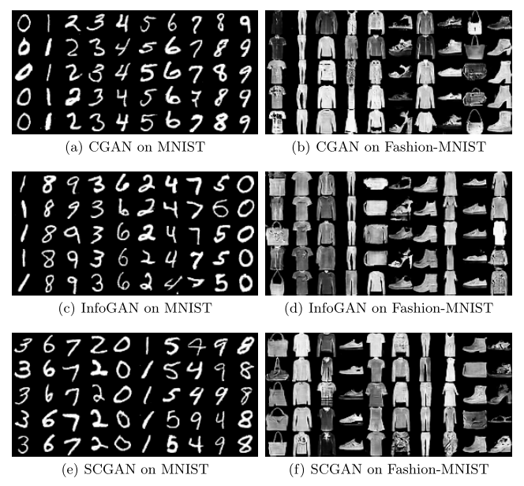
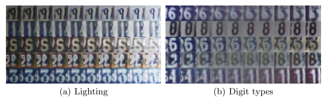
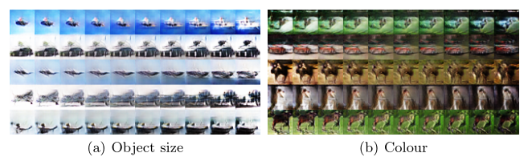
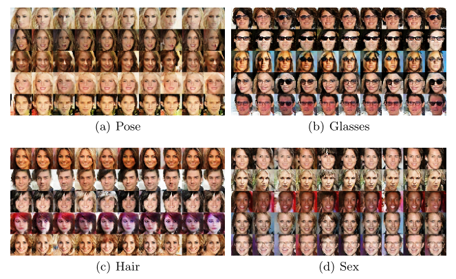

# SCGAN

Code for reproducing experiments in "SCGAN: Interpretable Representation Learning
by Adding Similarity Constraint on Generative
Adversarial Nets"

## Prerequisites

* Python
* Numpy
* Matplotlib
* Tensorflow >= 1.5

## Preparing datasets

The tree of directory is listed as follow:
- DATA_DIR
    + mnist
    + fashion-mnist
    + svhn
    + cifar10
    + celeba

The `DATA_DIR` is root directory of these datasets, you can set it any path you want, e.g. `/home/username`. Then you should download all datasets.

1. Download mnist dataset from [MNIST](http://yann.lecun.com/exdb/mnist), and put `train-images-idx3-ubyte.gz, train-labels-idx1-ubyte.gz, t10k-images-idx3-ubyte.gz, t10k-labels-idx1-ubyte.gz` into `DATA_DIR/mnist`.

2. Download fashion-mnist dataset from [Fashion-MNIST](https://github.com/zalandoresearch/fashion-mnist), and put `train-images-idx3-ubyte.gz, train-labels-idx1-ubyte.gz, t10k-images-idx3-ubyte.gz, t10k-labels-idx1-ubyte.gz` into `DATA_DIR/fashion-mnist`.

3. Download svhn dataset from [SVHN](http://ufldl.stanford.edu/housenumbers), and put `train_32x32.mat` into `DATA_DIR/svhn`.

4. Download cifar10 dataset from [CIFAR](http://www.cs.toronto.edu/~kriz/cifar.html), extract `cifar-10-batches-py` from `cifar-10-python.tar.gz`, and put `cifar-10-batches-py` into `DATA_DIR/cifar10`.

5. Download celeba dataset from [baidu](https://pan.baidu.com/s/1Z_6c19mLy2gVKnLYwQJXKw) or `google`, and put `celeba_0, celeba_1, celeba_2, celeba_3`(We have converted it to tfrecords) into `DATA_DIR/celeba`.

## MNIST & Fashion-MNIST

### Train on MNIST

```
python cgan_mnist.py --data_dir=DATA_DIR
python infogan_mnist.py --data_dir=DATA_DIR
python scgan_mnist.py --data_dir=DATA_DIR
```

### Test on MNIST

It will create `*.npy` which contains 10000 synthetic images.

```
python cgan_mnist.py --train=False --data_dir=DATA_DIR
python scgan_mnist.py --train=False --data_dir=DATA_DIR
python infogan_mnist.py --train=False --data_dir=DATA_DIR
```


### Train on Fashion-MNIST

```
python cgan_mnist.py --dataset_type=fashion-mnist --data_dir=DATA_DIR
python infogan_mnist.py --dataset_type=fashion-mnist --data_dir=DATA_DIR
python scgan_mnist.py --dataset_type=fashion-mnist --data_dir=DATA_DIR
```


### Test on Fashion-MNIST

It will create `*.npy` which contains 10000 synthetic images.

```
python cgan_mnist.py --train=False --dataset_type=fashion-mnist --data_dir=DATA_DIR
python infogan_mnist.py --train=False --dataset_type=fashion-mnist --data_dir=DATA_DIR
python scgan_mnist.py --train=False --dataset_type=fashion-mnist --data_dir=DATA_DIR
```

On MNIST and Fashion-MNIST, we find categorical conditional variables capture class labels, e.g., digit type, clothing type.

<div align=center>
    
</div>

### Gaussian Parzen Window

We use gaussian parzen window to estimate log-likelihood on 10000 synthetic images for each model.
```
python gaussian_parzen_window.py --data_dir DATA_DIR/mnist --gen_data_path result/cgan_mnist/cgan_mnist.npy --file result/cgan_mnist/cgan_mnist.txt
python gaussian_parzen_window.py --data_dir DATA_DIR/mnist --gen_data_path result/scgan_mnist/scgan_mnist.npy --file result/scgan_mnist/scgan_mnist.txt
python gaussian_parzen_window.py --data_dir DATA_DIR/mnist --gen_data_path result/infogan_mnist/infogan_mnist.npy --file result/infogan_mnist/infogan_mnist.txt
python gaussian_parzen_window.py --data_dir DATA_DIR/fashion-mnist --gen_data_path result/cgan_fashion-mnist/cgan_fashion-mnist.npy --file result/cgan_fashion-mnist/cgan_fashion-mnist.txt
python gaussian_parzen_window.py --data_dir DATA_DIR/fashion-mnist --gen_data_path result/scgan_fashion-mnist/scgan_fashion-mnist.npy --file result/scgan_fashion-mnist/scgan_fashion-mnist.txt
python gaussian_parzen_window.py --data_dir DATA_DIR/fashion-mnist --gen_data_path result/infogan_fashion-mnist/infogan_fashion-mnist.npy --file result/infogan_fashion-mnist/infogan_fashion-mnist.txt
```

Gaussian Parzen window-based log-likelihood estimates for MNIST and Fashion-MNIST.

<table align="center">
    <thead>
        <tr>
            <th align="left">Model</th>
            <th align="left">MNIST</th>
            <th align="left">Fashion-MNIST</th>
        </tr>
    </thead>
    <tbody>
        <tr>
            <td align="left">CGAN</td>
            <td align="left">228.1 &plusmn; 2.2</td>
            <td align="left">312.7 &plusmn; 2</td>
        </tr>
        <tr>
            <td align="left">InfoGAN</td>
            <td align="left">231 &plusmn; 2.2</td>
            <td align="left">320.2 &plusmn; 2</td>
        </tr>
        <tr>
            <td align="left">SCGAN</td>
            <th align="left">233.6 &plusmn; 2.2</th>
            <th align="left">321.7 &plusmn; 2</th>
        </tr>
    </tbody>
</table>


## SVHN & CIFAR10

### Train on SVHN

```
python scgan_svhn.py --data_dir=DATA_DIR
```

### Test on SVHN

Fix one conditional variable, and vary the other conditional variable.

```
python scgan_svhn.py --train=False --data_dir=DATA_DIR --con_dim=0
python scgan_svhn.py --train=False --data_dir=DATA_DIR --con_dim=1
```

We select some good-quality synthetic images. Continuous variables capture variation on lighting and digit types.
<div align=center>
    
</div>


### Train on CIFAR10

```
python scgan_cifar.py --data_dir=DATA_DIR
```

### Test on CIFAR10

Fix one conditional variable, and vary the other conditional variable.

```
python scgan_cifar.py --train=False --data_dir=DATA_DIR --con_dim=0
python scgan_cifar.py --train=False --data_dir=DATA_DIR --con_dim=1
```

We select some good-quality synthetic images. Continuous variables capture variation on object size and colour.
<div align=center>
    
</div>

## CelebA

### Train on CelebA

```
python scgan_celeba.py --data_dir=DATA_DIR
```

### Test on CelebA

Fix three conditional variables, and vary the remaining conditional variable.

```
python scgan_celeba.py --train=False --data_dir=DATA_DIR --con_dim=0
python scgan_celeba.py --train=False --data_dir=DATA_DIR --con_dim=1
python scgan_celeba.py --train=False --data_dir=DATA_DIR --con_dim=2
python scgan_celeba.py --train=False --data_dir=DATA_DIR --con_dim=3
```

We select some good-quality synthetic images. Categorical variables capture variation on pose, glasses, hair and sex.
<div align=center>
    
</div>

### Note: There is no guarantee that one conditional variable just captures a kind of representation, so that InfoGAN uses ten 10-dimensional categorical variables to capture these representations.

## Citing SCGAN
If you use SCGAN in your research, we would appreciate references to the following paper:

Biblatex entry: